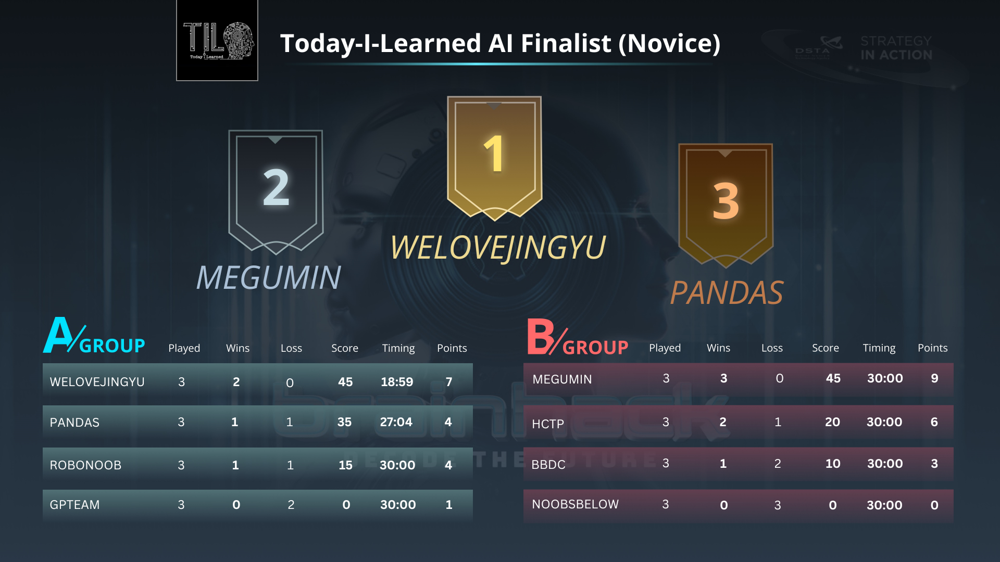
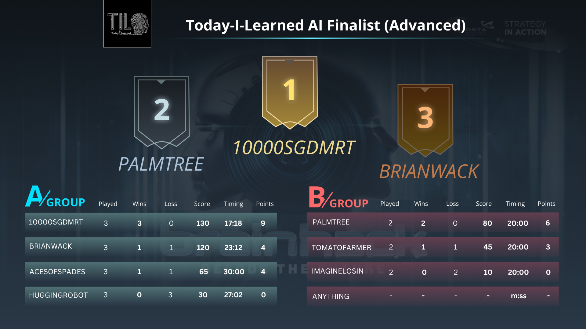
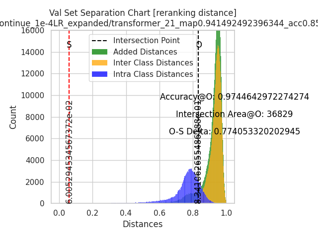
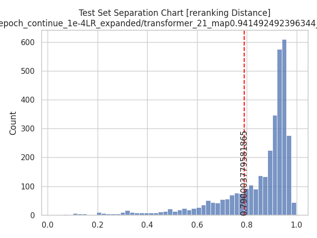
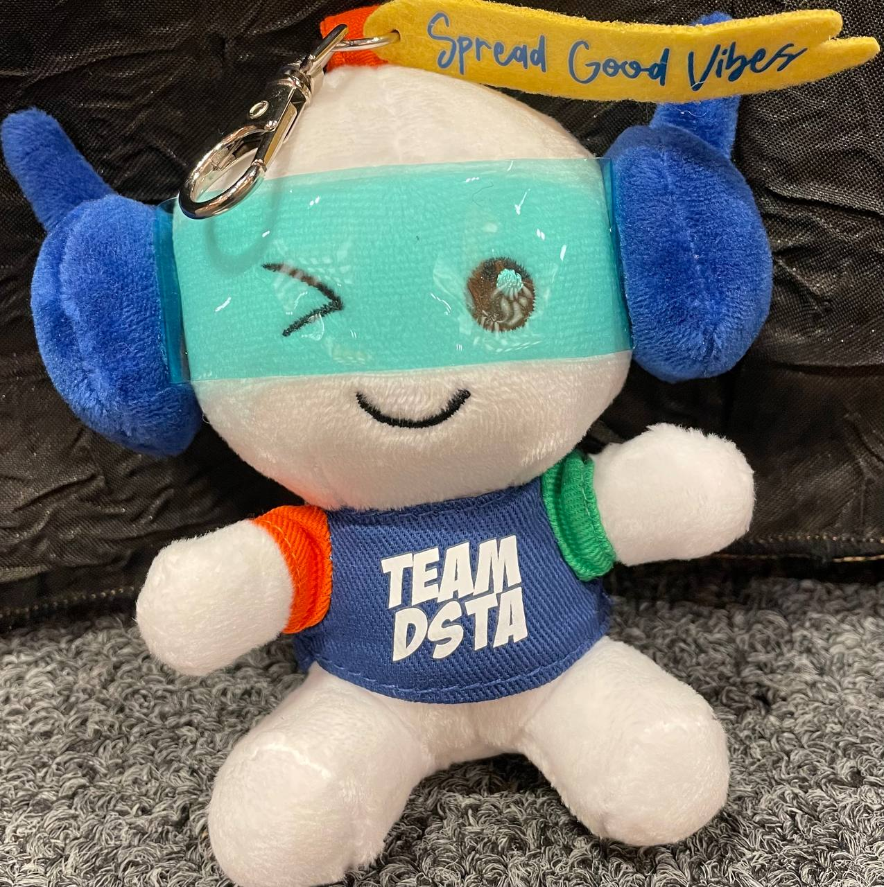
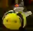

# DSTA Brainhack Today-I-Learnt AI Hackathon 2023

#### Team: 10000SGDMRT
#### School: [Hwa Chong Institution Infocomm & Robotics Society (HCIRS)](https://github.com/hcirs) Machine Learning section
#### Achievement: Champion in Advanced category, with a perfect score in the final match

### Team members
* [Billy Cao](https://github.com/aliencaocao) (L): ASR/SpeakerID/OD/ReID/Robot
* [Marcus Wee](https://github.com/Marcushadow): ASR
* [Ho Wing Yip](https://github.com/HoWingYip): ASR/SpeakerID/OD/ReID/Robot
* [Huang Qirui](https://github.com/hqrui): Robot
* [Alistair Cheong](https://github.com/cheongalc): ASR/SpeakerID/OD/ReID/Robot

## Contents
<!-- TOC -->
  * [Introduction](#introduction)
    * [Qualifiers](#qualifiers)
    * [Qualifiers private leaderboard](#qualifiers-private-leaderboard)
    * [Finals](#finals)
    * [Finals leaderboard](#finals-leaderboard)
  * [ASR](#asr)
    * [Data Augmentation](#data-augmentation)
    * [Model](#model)
    * [Training](#training)
    * [Inference](#inference)
    * [Finals-specific tuning](#finals-specific-tuning)
  * [Object Detection](#object-detection)
    * [Data Augmentation](#data-augmentation-1)
    * [Model](#model-1)
    * [Training](#training-1)
    * [Inference](#inference-1)
    * [Finals-specific tuning](#finals-specific-tuning-1)
  * [Object Re-Identification (REID)](#object-re-identification-reid)
    * [Data Augmentation](#data-augmentation-2)
    * [Model](#model-2)
    * [Training](#training-2)
    * [Inference](#inference-2)
    * [Finals-specific tuning](#finals-specific-tuning-2)
  * [Speaker Identification](#speaker-identification)
    * [Data Preprocessing - denoising](#data-preprocessing---denoising)
    * [Data Augmentation](#data-augmentation-3)
    * [Model](#model-3)
    * [Training](#training-3)
    * [Inference](#inference-3)
    * [Finals-specific tuning](#finals-specific-tuning-3)
  * [Robot](#robot)
    * [Localization](#localization)
    * [Path planning](#path-planning)
    * [Movement](#movement)
  * [Conclusion](#conclusion)
<!-- TOC -->

## Introduction
This repository contains all the code used for our team at TIL 2023 except for model weights. If you would like the weights, you may email aliencaocao@gmail.com. 

TIL 2023 has 2 categories: Novice and Advanced. The advanced category are for teams with prior experience in AI/Robotics and/or have taken relevant courses in university. Our team was placed into this category as we won [TIL 2022](https://github.com/aliencaocao/TIL-2022).

The competition has 2 stages: qualifiers and finals.

### Qualifiers
In qualifiers, participants are given 2 tasks:
1. ASR: Speech to text on Singaporean accent dataset. For advanced category, the dataset has been mixed with noise and time masking.
2. CV: Single-class object detection of soft toys (plushie), chained with Object Re-identification on unique plushies (identifying same plushie from different images take from different angles). For advanced category, the dataset has been mixed with camera noise and white balance perturbation.

The combined ranking is determined by the average ranking of a team in each task, tie breaking using average absolute score.

### Qualifiers private leaderboard
* [Novice ASR](leaderboards/nov_asr.json)
* [Novice CV](leaderboards/nov_cv.json)
* [Novice Combined](leaderboards/nov_combined.json)
* [Advanced ASR](leaderboards/adv_asr.json)
* [Advanced CV](leaderboards/adv_cv.json)
* [Advanced Combined](leaderboards/adv_combined.json)

Team 10000SGDMRT obtained 3rd on ASR with Word Error Rate (WER) of 1.4049318056670998%; 1st on CV with mean average precision @ IoU=0.5 (mAP=0.5) of 0.9301437182295662. This gave us a combined score of 0.9580472000864476 and placing us top in the Qualifiers in Advanced category.

### Finals
In finals, participants are given additional 2 tasks:
1. Speaker Identification: Identify the speaker of a given audio clip. These audio clips are recorded by finalists and teams need to identify the team and member ID of the speaker. For advanced category, the dataset has been mixed heavily with noise. Training data is extremely limited at 1 sample per class, and validation set is also limited at 5 samples (only 5/32 classes are covered).
2. Integration of ASR, Object Detection, Object Re-identification and Speaker Identification to drive a DJI Robomaster robot around a maze. The robot has to automatically plan paths and navigate to task checkpoints, then perform these tasks correctly there.

The finals are split into 2 groups. First, round-robin is carried out within each group, then, top place of each group compete for 1st and 2nd place, while 2nd place from each group compete for 3rd and 4th place. Ranking within each group is determined by maze score, which is calculated by `10 * (correct OD+ReID tasks) + 5 * correct SpeakerID tasks`. The ASR task was used to determine whether the robot will receive the next task checkpoint or a detour checkpoint. Each run is capped to 10 minutes and teams in Advanced category has 5 checkpoints to clear. Time to finish all 5 checkpoints will be used as a tiebreaker.

Our team's final run: https://www.youtube.com/watch?v=zCUGX4jAcEk

### Finals leaderboard
Note that the scores under group A/B are not inclusive of top-3 matches, but only for round-robin matches that determines which team advances to the top-3 matches. Our team got perfect score of 75points in the final top-2 match against PALMTREE, with run time of 6 min 26 seconds.

Team ANYTHING was disqualified due to their absence during finals.

## Our solution
We will introduce our approaches below. Each part contains a finals-specific tuning section where we document things we have done to improve score during finals according to the rules.
## ASR
All code can be found in [ASR](ASR).
### Data Augmentation

* SpecAugment with feature masking probability of 0.3 and size of 10 samples, no time masking as it may cause spoken words to be masked. This is built in by Hugging Face Transformers
* [Audiomentations](https://github.com/iver56/audiomentations):
    1. HighShelfFilter(max_gain_db=6.0, p=0.3)
    2. LowShelfFilter(max_gain_db=6.0, p=0.3)
    3. TimeStretch(min_rate=0.9, max_rate=1.1, p=0.2)
    4. BandPassFilter(p=0.3)

Audiomentation augmentations are determined by listening to and reverse-engineering test samples using wave form and spectrum analysis.

### Model
We used Meta's [wav2vec2-conformer-rel-pos-large-960h-ft](https://huggingface.co/facebook/wav2vec2-conformer-rel-pos-large-960h-ft), which is a Wav2Vec2-conformer model with relative position embedding fine-tuned on 960 hours of LibreSpeech dataset. This model was proposed in [fairseq S2T: Fast Speech-to-Text Modeling with fairseq](https://arxiv.org/abs/2010.05171) table 3 and 4. It is best open-sourced model on LibriSpeech test-other dataset according to [Paperswithcode](https://paperswithcode.com/sota/speech-recognition-on-librispeech-test-other). We chose test-other dataset as it contains more noise than test-clean which suits our test data more.

### Training
We unfroze the entire network (instead of the classification layers only) and fine-tuned on DSTA-provided 3750 samples of audio data. We trained for 30 epochs but took the best checkpoint (lowest val WER) at step 2337 (around 25 epoch), then resumed training from there for another 20 epochs at a lower learning rate.
* Optimizer: AdamW with lr=1e-4 for first 30 epoch run then continue with 1e-6 for another 20 epoch, beta1=0.9, beta2=0.98, weight decay=1e-4. Within each run, we linearly warm up lr from 0 for first 10% of steps, then do cosine decay for the rest of the steps until 0.
* Batch size: with usage of gradient accumulation, we had effective batch size of 32.
* Trained in FP16 with mixed precision.

Training log for the 2nd part (20 epoch @ lr=1e-6) can be found [here](ASR/wav2vec2-conformer/trainer_state.json).

Although we managed to obtain and preprocess the [IMDA National Speech Corpus](https://www.imda.gov.sg/how-we-can-help/national-speech-corpus), our model failed to converge on these data, possibly due to low label quality, so we did not use them.

### Inference
In addition to normal inference, we use [language-tool-python](https://pypi.org/project/language-tool-python/) to correct spelling and grammar errors automatically, although it's not perfect, it improved WER slightly. This is needed as our model uses character-based tokenization (E.g. letter based) instead of word-based like Whisper.

Model ensemble via logit averaging was found to be bad for character-based tokenization, so we did not use it.

### Finals-specific tuning
Code for finals deployment are in [Robot/nlp_service.py](Robot/nlp_service.py), under `ASRService`.

The finals task is to recognize a digit from zero to nine in a given sentence. In other word, our model only has to get the digit part of the audio correct. Thus, we developed a fuzzy-retrival algorithm that uses string similarity to match and look for possible misspelled digits in the raw output. Again, this is only an issue as it is character-based tokenization.

We used [Levenshtein distance](https://pypi.org/project/python-Levenshtein/) as a metric of string similarity, and computed it across every word in the raw output against every digit, forming a 2D matrix. Then we take the globally most similar word and assume that it is the misspelled version of that closest digit. In the event where multiple words has the same similarity, it ignores some common words that can happen to have a high similarity with certain digits, like 'To' and 'Two', only taking them if no other word has the same level of similarity. The common words list used was ['TO', 'THE', 'THEY', 'HE', 'SHE', 'A', 'WE'].

Eventually, this algorithm was never activated once during finals as our model was good enough that it predicted everything perfectly. We had a 100% accuracy for ASR during finals.

## Object Detection
All code can be found in [CV/InternImage](CV/InternImage). The `CV` folder also contains some of our tried and ditched models:
* GroundingDINO: zero shot object detection guided by text prompt. We prompted 'plushie'. It has 0.345255479 mAP on bbox only (no REID).
* RT-DETR-X: novel fast and accurate YOLO-series replacement. We had highest mAP of 0.915573138 by this model combined with our best REID model, just 0.015 shy of our best using InternImage (and same REID model). We used implementation from [PaddleDetection](https://github.com/PaddlePaddle/PaddleDetection/tree/develop/configs/rtdetr). We tried various augmentations and none of them seemed to have helped.
* SAM: failed attempt to use zero-shot masks as bbox. We found that mask overlapping is a major issue and could not find a reliable NMS algorithm to handle them.
* yolov7 and yolov8: both underperformed RT-DETR, even with gaussian noise augmentations.

The other folders in `CV` are for ReID task. We will only explain our best performing model, [InternImage](https://github.com/OpenGVLab/InternImage).
### Data Augmentation
Default used in InternImage, including RandomFlip and AutoAug. See [our config](CV/InternImage/detection/work_dirs/cascade_internimage_l_fpn_3x_coco_custom/cascade_internimage_l_fpn_3x_coco_custom.py).

### Model
We used InternImage-L with Cascade Mask R-CNN with 3x schd. It has 56.1mAP on COCO, 277M parameters and 1399GFLOPS. The backbone is pretrained on ImageNet-22K on a variable input size between 192 to 384px.

### Training
We used default hyperparameters except for batch size where we had to set to 1 for it to not OOM. We trained for 30 epochs but took the 12th epoch as it is the best checkpoint (val mAP@0.5-0.95 of 0.8652, mAP@0.5 of 1.0).

Since the model uses Mask R-CNN, we had to process the bbox label given into mask labels too, by simply taking the bbox as a rectangle mask. The model does output both bbox and mask, so during inference we took the bbox output only.

Our training log is [here](CV/InternImage/detection/work_dirs/cascade_internimage_l_fpn_3x_coco_custom/20230601_224318.log).

### Inference
By visualizing and manually checking through every single bbox on test set, we found that this model produces exceptionally high confidence score, often above 0.999. We found some false positives with relatively high confidence of 0.8+. Therefore, for qualifiers, we inferred with confidence threshold of 0.99, and take the top 4 confidence one if there are more than 4 (competition rules specified this).

### Finals-specific tuning
Code for finals deployment are in [Robot/cv_service.py](Robot/cv_service.py).

Although the model is very good at the task already, during our first day in finals, we found that it struggles to detect very small targets, especially a bee plushie, since the robot's camera is wide angle and the plushie itself is much smaller than average. It also has some false positives caused by the aruco codes on the floor. To counter this issue, we applied cropping to the robot camera view, by cropping 100px from top, left and right, and 280px from bottom, making the effective image size to be 900x520. This effectively zooms in and enlarge all the targets, while cropping away the floor most of the time. We also reduced confidence threshold to 0.9 as it still tend to give lower confidence on smaller objects.

## Object Re-Identification (REID)
All code can be found in [CV/SOLIDER-REID](CV/SOLIDER-REID). This is a heavily modified fork from the [original repo](https://github.com/tinyvision/SOLIDER-REID). Specifically, we
* Added batched inference support
* Customized augmentations
* Added TIL Custom dataset
* Added plotting code for distance distribution
* Various bug fixes for loading and saving models

Nonetheless, we would like to thank the authors of the original repo for their work and their assistance in helping us debug our code.

SOLIDER-REID is a downstream task of a greater pretraining framework called SOLIDER, developed by Alibaba DaMo Academy, published in their CVPR 2023 paper [Beyond Appearance: a Semantic Controllable Self-Supervised Learning Framework for Human-Centric Visual Tasks](https://arxiv.org/abs/2303.17602).

This approach was the state-of-the-art (as of May 2023) on the largest person-reid dataset MSMT17. Although this is primarily for human-reid, we found no other 'generalized' object-reid benchmarks, so we had to trust it and that the scale of the dataset is large enough to reflect the generalization ability of the model on cross-domain tasks. Turns out we were not wrong on this, and the model performed well on our task.

### Data Augmentation
We changed the default input size of the model from 384x128 to 224x224, reason being the plushie may not be a rectangle all the time like human, and the backbone (Swin-base) was pretrained on ImageNet-22k with input size 224x224.

We used the default augmentations from the original repo, which includes RandomHorizontalFlip(p=0.5), RandomCrop(size=224), RandomErasing(p=0.5, mode=pixel, max_count=1).

We added the following:
* GaussianNoise(probability=0.5, noise_strength=25). Our implementation can be found [here](CV/SOLIDER-REID/datasets/transforms.py). The aim is to emulate the camera ISO noise in our test set.
* Rotation Expansion. We hypothesize that unlike human who can only appear in an image standing up right (assuming no one is lying down or sitting), plushies can (and will) be placed in all sorts of directions, like up-side-down, lying horizontally etc. For the REID model to learn to be invariant to orientation of a plushie, we need to explicitly tell it to learn from different orientations. Thus, we rotated all test images by 90 degrees 3 times to cover the entire 360 degrees cycle, effectively 4x the dataset size. This has improved our leaderboard score slightly (as it was already very high) but we found it to become much more robust.

We tried a bunch of other augmentations and all of them decreased performance so they will not be listed here, however they are still in the codebase.

We also tried to correct the white balance of images during train and test as they affect coloring of the plushies and could negatively affect the model. We used [Deep-White-Balance](https://github.com/mahmoudnafifi/Deep_White_Balance) and the results were visually satisfactory. See [here](CV/utils/awb%20exp) for sample images. Yet, this somehow significantly reduced our model performance, so we did not use it in the end. Our hypothesis is that the white balancing model actually causes different plushies to look a lot more similar (much more to the model's eye than to ours), and thus the model had a hard time differentiating them. We semi-verified this by plotting the distance distribution and seeing all of them are very close e.g. no clear separation. We also tried to use non-deep learning based approaches like gray world or other algorithms in OpenCV and online, and none of them worked better than the DL approach visually.

### Model
We fine-tuned from the model pretrained on MSMT17 dataset as it is the largest. The model uses Swin-base transformer as backbone. We tried Swin-Large and found it underperformed slightly possibly due to overfitting.

### Training
Training this model proved to be especially tricky, as it tends to overfit quickly and this is hard to detect given the small validation set size (only 10 unique plushies). We had to run many times and made many submissions to find the way to pick the less-overfitting one. Specifically, we had to strike a balance between validation metrics like val mAP and training epochs. It has been shown repeatedly that anything above 92 for val mAP will be non-representative, meaning performance of a model getting mAP 92.0 vs 95.0 on val set may not follow the same trend. In fact, more than often they are opposite. We went for high epoch number (100+) combined with a relatively high mAP (93-94).

We modified the default hyperparameters through countless trial-and-error. Our final hyperparameters can be found in [config file](CV/SOLIDER-REID/TIL.yml). Similar to ASR, we took the 2-stage approach, where we first train the model with a higher initial LR of 5e-3 for 500 epoch, then we took the best performing one (based on heuristics mentioned above), which ended up being epoch 189. We then continued from epoch 189 for another 400+ epoch, with initial LR of 1e-4. We chose epoch 21 from this continued run.

* Optimizer: SGD with weight decay=1e-4, 3 warm up epoch and cosine decay LR.
* Batch size: 128
* Loss: average of Cross Entropy Loss and Triplet Loss. 
  * The Cross Entropy Loss is calculated only on training data where number of class is known (200). The model has 2 output heads, 1 is features (1024-dim), another is softmax (200 classes). During training, sum of both loss are used for back-propagation. During inference, only the features head is used to get raw features. This guides the model to converge and generate more useful feature.
  * The Triplet Loss is a customized one that uses harder example mining to maximize the loss's effectiveness. See [here](CV/SOLIDER-REID/loss/triplet_loss.py) for implementation.

Initial run of LR=5e-3 training log can be found [here](CV/SOLIDER-REID/archive%20models/log_SGD_500epoch_5e-3LR_expanded/initial_train_log.txt).

Continued run of LR=1e-4 training log can be found [here](CV/SOLIDER-REID/log_SGD_500epoch_continue_1e-4LR_expanded/continue_train_log.txt).

### Inference
We use the [K-reciprocal Encoding for Re-ranking](https://arxiv.org/abs/1701.08398) algorithm and it improved mAP slightly for us. In order to find the right threshold, we plotted the distance distribution like this:

On validation set:

On test set:

Initially using the thresholds directly found at the minium point did not give us a very high score. We suspect it is due to too many false positives, thus we assumed and limited the number of suspects per image to 1 (even though the competition rule did not specify) and used a more loose threshold to reduce false negatives. Doing so greatly improved our score by about 10mAP.

We also tried inferring on rotated image (4x90 degrees) and average their feature before calculating distance. This did not bring any improvement.

### Finals-specific tuning
For finals, we cannot use Reranking as the distance produced by RR changes with gallery size. In finals, we only have a gallery size of about 1-3 images, while in qualifiers we had 3417. Thus, we went to find the best threshold using euclidean distance based on leaderboard score, which turned out to be 1.05. However, this proved to be slightly off for finals, as we gathered data and analyzed the distance matrix produced during day 1's runs. Eventually, we reduced it slightly to be 1.0.

In the event that multiple plushies passes this 1.0 threshold, we take the minimum as the rules specified that there can be no suspect and hostage in the same place.

We initially had issues of false positives in our Object Detection as it kept detecting the floor and black tapes as a plushie. Interestingly those floor images ended up having very high similarity as the hostage in our REID model, causing us to predict many false positive for `hostage`. Applying cropping solved this issue.

We also realise that the query image given for finals is way higher resolution than the ones given during qualifiers, while the gallery image (crops of bbox from robot camera) is of much smaller resolution than the qualifier, partially due to robot's wide angle camera and far distance from the plushies.

For example, a query image from qualifiers are around the size 170x160, and gallery are around 120x100. While in finals, the hostage Mr Dastan, is 1275x1280, and most of the bbox we get is around 70x70.

Mr Dastan (1275x1280)

A bbox of a bee plushie (61x65)

We hypothesis that this causes significant loss or instability in up/down scaling during resize operations, where images has to be resized to 224x224 for the REID model. We tried different resizing algorithms available in `OpenCV`, and they had shockingly large impact on our REID distance matrix:
 
Below are the comparison of distance matrix produced by our REID model using different resizing algorithms. This is calculated on bbox crops of various plushies captured by the robot against a [green dinosaur suspect](Robot/data/imgs/SUSPECT_2.jpg) and the hostage [Mr Dastan](Robot/data/imgs/HOSTAGE.jpg). The threshold is 1.0 so anything below 1.0 will be a positive. The optimal goal is to make true positives close to 0 and true negatives close to infinity. The default is Linear and is used for both training and testing.

2 bbox detected. First bbox has correct answer `none`:

| Algorithm | Distance VS suspect | Distance VS hostage |
|:---------:|:-------------------:|:-------------------:|
|   Cubic   |        1.44         |        1.12         |
|  Linear   |        1.46         |        1.15         |
|  Nearest  |        1.34         |        0.97         |
|   Area    |        1.36         |        1.09         |

Using `Nearest` would have caused an FP on `hostage`, though very close to the threshold. However, `Nearest` clearly outperforms `Cubic` and `Linear` in other examples below.

Second has correct answer `suspect`:

| Algorithm | Distance VS suspect | Distance VS hostage |
|:---------:|:-------------------:|:-------------------:|
|   Cubic   |        1.44         |        1.56         |
|  Linear   |        1.44         |        1.55         |
|  Nearest  |        0.69         |        1.30         |
|   Area    |        0.67         |        1.52         |

In this case, `Cubic` and `Linear` clearly underperformed `Nearest` or `Area`. They produced shockingly different distances for the `suspect` query. `Area` outperformed `Nearest` as the distances are wider apart.

We have done similar tests on samples of the hostage and result are in a uniform trend that clearly shows `Area` > `Nearest` > `Cubic` ~= `Linear`. If you would like more comparison data, you can open a Discussion. We also have compared cases where all 4 algorithms getting it correct, and the performance in terms of distance produced is on par. In other word, there is little downside but huge upside by switching from `Linear` to `Area`.

This may be against many's intuition as `Linear` or `Cubic` are supposed to be of much finer detail than `Nearest` and `Area` when doing scaling, and are often much preferred over the latter 2. However, we think that the large difference between the source resolutions (1000+ px vs 100- px) made uniformity much more important than preserving details. Both `Cubic` and `Linear` can produce images that contains details which may actually negatively impact the model, since many details that are present in the query image may not exist in gallery, or exist in a very different form due to camera blur etc. While fast and less 'fine-grained' algorithms like `Nearest` and `Area` does not include these details that proved to be unnecessary for REID task, thus is able to perform better. This hypothesis can be supported by our leaderboard score produced on the qualifiers test set using different scaling algorithms, where `Linear` scored best and `Nearest` scored about 8mAP lower (which is a massive degradation). This shows that when query and gallery are of similar resolution, using a higher-identity algorithm is preferred, but when they are of very different resolution, using a lower-identity algorithm can be better.

## Speaker Identification
All the code for this task is in [SpeakerID](SpeakerID). It was only introduced to finalists and is not part of qualifiers.

For the core SpeakerID model, we forked and modified code from [m2d](https://github.com/nttcslab/m2d). More details are [below](#model-3). This is based on the ICASSP 2023 paper [Masked Modeling Duo: Learning Representations by Encouraging Both Networks to Model the Input](https://arxiv.org/abs/2210.14648) by researchers from NTT Corporation, Japan.

This task proved to be very challenging as:
1. The noise injected into the training and test samples are very strong and overwhelms the speaking voice
2. Team PALMTREE decided to whisper into all their recordings, and when overlaid with the noise, it is very hard to hear anything
3. Very small training and validation dataset: one 15s sample per class for training, and total of five 15s samples for validation, covering only 5/32 classes.
4. Shortage of time to train and experiment

### Data Preprocessing - denoising
The training and test data are injected with noise and our model failed to learn much from unprocessed audio. We had to do denoising or speech enhancement for the model to learn. We tried many different pretrained models and decided on using 2 of them combined with a chain of loudness-related processing as a multi-stage preprocessing pipeline. This pipeline is being used during inference in finals too.

The entire denoising pipeline is in [this notebook](SpeakerID/denoise.ipynb).

#### Step 1: Denoising using FRCRN
We use [FRCRN](https://github.com/alibabasglab/FRCRN) pretrained on the 16Khz [Deep Noise Suppression (DNS) Challenge](https://github.com/microsoft/DNS-Challenge) dataset by Microsoft. FRCRN (Frequency Recurrent Convolutional Recurrent Network) is a model proposed by Alibaba Singapore AI Lab in collaboration with NTU School of Electrical and Electronic Engineering in their ICASSP 2022 paper [FRCRN: Boosting Feature Representation using Frequency Recurrence for Monaural Speech Enhancement](https://arxiv.org/abs/2206.07293). The model achieved 2nd ranking on the [DNS Challenge 2022](https://www.microsoft.com/en-us/research/academic-program/deep-noise-suppression-challenge-icassp-2022/results/), and was the only open-sourced high-ranking solution of DNS Challenge that we found. We did not find any high-ranking open-sourced solutions for [DNS Challenge 2023](https://www.microsoft.com/en-us/research/academic-program/deep-noise-suppression-challenge-icassp-2023/results/).

The model was easy to integrate and only 58MB in size. It is published on [ModelScope](https://modelscope.cn/models/damo/speech_frcrn_ans_cirm_16k/summary).

#### Step 2: Normalize peak gain to -0.1dBFS

There is, however, an issue with the output of FRCRN, whether it is intentional or not. The output is extremely soft, although the noise are very well suppressed. It is also slightly muffled. This causes our next denoising step to fail as it tend to think the soft speech output is noise. Therefore, we did volume normalization to make the peak -0.1dBFS using [pyloudnorm](https://github.com/csteinmetz1/pyloudnorm).

#### Step 3: Denoising using DeepFilterNet3 (DF3)
[DeepFilterNet](https://github.com/Rikorose/DeepFilterNet) is a series of open source model for speech denoising. The latest 3rd generation is proposed by researchers at Pattern Recognition Lab of University of Erlangen-Nuremberg and WS Audiology in [DeepFilterNet: Perceptually Motivated Real-Time Speech Enhancement](https://arxiv.org/abs/2305.08227), published just weeks before this competition.

We decided to use both FRCRN and DF3 for best effect as they have very similar performance and are good at different areas. DF3 is being used later as it is weaker at removing noise that mixes well with speech, and we found that if we use DF3 first then FRCRN, FRCRN could not effectively detect and remove those noise mixed with speech. FRCRN is weaker at removing static noise outside of speech so it needed DF3 to take care of them.

You can listen to samples in [denoised samples.zip](SpeakerID/denoised%20samples.zip) for comparison between different denoising models we tried. In addition to DF3 and FRCRN, we also tried Nvidia's [CleanUNet](https://github.com/NVIDIA/CleanUNet/tree/main) and the classic [RNNoise](https://github.com/Desklop/RNNoise_Wrapper).

#### Step 4: Normalize peak gain to -0.1dBFS again
Although DF3 does not make output much softer like FRCRN does, it still helps for model training to normalize the loudness on final output to prevent the model from being sensitive to volume. This also helps to boost speech signal. This step is same as step 2.

#### Special treatment for Team PALMTREE
Team PALMTREE was being smart and utilized the competition rules fully, by whispering into the recording, making them almost inaudible when overlaid with noise. FRCRN proved to be effective in isolating their whispering, but DF3 will then remove them, thinking them as noise. Therefore, for PALMTREE samples, we only apply FRCRN denoising, skipping step 3. We also replaced step 4 (peak gain normalization) with ITU-R BS.1770 loudness meter, normalized to -18.0 LUFS, as it produces louder volume. We did not use this for other team's audio as it tend to cause clipping.

In finals during inference, we employ additional measures to differentiate PALMTREE audio and other team, which will be described [below](#finals-specific-tuning-3).

#### Effectiveness
Denoising significantly improved our model training, boosting validation accuracy from 20% to 95%. Below are 2 samples, one from our own team, another from team PALMTREE. Our pipeline proved to be effective in both cases, and has maintained a surprising 100% accuracy during finals, especially against team PALMTREE.

10000SGDMRT before denoise:

https://github.com/aliencaocao/TIL-2023/assets/20109683/8ada57aa-5360-4a18-aa0c-749fcd571f7e

After denoise: 

https://github.com/aliencaocao/TIL-2023/assets/20109683/c7dbd8b4-2ad9-4b04-ae56-532d1a51f055

PALMTREE before denoise:

https://github.com/aliencaocao/TIL-2023/assets/20109683/77ab309f-803f-414d-bb71-22b51e4d8a13

After denoise:

https://github.com/aliencaocao/TIL-2023/assets/20109683/90afb760-e9a4-4e79-ad09-234ce8905feb

### Data Augmentation
Having only 1 sample per class is extremely limiting, therefore we employed many techniques to augment our data.

Firstly, the competition rules banned usage of any TTS/self recorded/out-sourced datasets, so techniques like [VITS](https://github.com/jaywalnut310/vits) and [TorToiSe TTS](https://github.com/neonbjb/tortoise-tts) are not applicable.

We decided to expand the dataset by slicing each 15s sample into 5 slices of 3s, since speech continuity/completeness is not crucial in SpeakerID, but rather the sound characteristics. A single sample of 15s is different from 5 samples of 3s in training as the context length and information will be isolated and thus provides more variety. We did the same to validation set and during inference. We find that the microphone used to record often peaks or produces noise in the first second, and that most of the first few seconds are silent. Thus, we remove the first 3s slice and only use the rest 4. This increased our sample count to 128.

We want to avoid touching frequency-related or tone/pitch related features, so we only went with time domain.

* [Audiomentations](https://github.com/iver56/audiomentations):
    1. Shift(p=0.5, min_fraction=-0.5, max_fraction=0.5): shifts 50% of samples forward or backward
    2. Reverse(p=0.5): reverses the audio
    3. TimeStretch(p=0.5, min_rate=1/1.2, max_rate=1/0.8): this means the maximum length of audio will change by either 0.8x or 1.2x

We modified the default built-in augmentations following the fine-tuning parameters reported in the paper on VoxCeleb1(VC1) dataset. Notably, we (following the paper), disabled most built-in augmentations as SpeakerID is too sensitive to those.

* Built-in by the M2D repository:
    1. Time masking of 70 samples
       * This value is calculated to emulate its effect on the VC1 dataset on our own TIL dataset. The default length of VC1 dataset is 8.2s and the number of frames is 820 (1 frame = 10ms). The default time mask samples for VC1 dataset is 192. This means the masking ratio is about 192/820 = 0.23414634146. With our 3-second slicing, the number of frames will be 300. Applying the same ratio, that would be 300 * 0.23414634146 ~= 70.

### Model
The new M2D (Masked Modeling Duo) architecture proposed in the paper was actually not the SOTA on SpeakerID task, though it is on serval other speech domain tasks. The actual SOTA was an older model also by the same group of researchers, named MSM-MAE (Masked Spectrogram Modelling - Masked Autoencoders). It was proposed in another paper [Masked Spectrogram Modeling using Masked Autoencoders for Learning General-purpose Audio Representation](https://arxiv.org/abs/2204.12260). However, in the newer M2D paper, the researcher improved on their previous MSM-MAE work by pretraining it with more data and better hyperparameters, and adjusted the decoder head sizes. They also published the new weights in the new M2D repository so we did not use the old MSM-MAE repository. The new and improved results of MSM-MAE was shown in Table 5 of the M2D paper, where they reported 95.3% accuracy on the VC1 dataset.

The model has 3 parts.
1. A ViT-B encoder pretrained on [AudioSet](http://research.google.com/audioset/) to predict masked log-melspectrograms to encode them into 3840-d features.
2. A Transformer decoder of 4 layers, 6 heads and 384 output dimension (optimized from the original decoder proposed in MSM-MAE paper).
3. A linear layer to classify the output of the decoder into 32 classes.

Part 1 is pretrained and available to download [here](https://github.com/nttcslab/m2d/releases/tag/v0.1.0), choosing the `msm_mae_vit_base-80x608p16x16-220924-mr75.zip`.

Part 2 and 3 are trained from scratch on our own dataset and saved independently, about 370MB.

### Training
We followed hyperparameters used to fine-tune on the VC1 dataset, as reported in the M2D paper in Table 2. Our training config can be found [here](SpeakerID/m2d/evar/config/m2d.yaml).

* Optimizer: AdamW with learning rate 1e-3, 1000 warmup epoch (equal to 2000 steps)
* Batch size: 108
* Max 7000 epoch but we took epoch 866 as subsequent ones start to overfit

The final model had validation accuracy of 90%, but considering that validation set is only 4x4 samples from 4 classes, it is at max indicative. Unfortunately, we did not have any other ways to further verify it without breaching competition rules.

### Inference
During inference, we slice the test audio into 5 slices and take the last 4 to run inference similar to training and validation set, then did weighted average on the logits based on the length of each slice. This is in a way ensembling, but data-based instead of model-based, since model-based is too risky given the limited validation set size.

### Finals-specific tuning
For finals, we are given a pair of audio files at each task checkpoint, 1 of them will be from our team, another will be from our opponent team. We know the opponent team beforehand and was allowed to edit our code based on this information. To maximize accuracy, we limit the final prediction to be only between the 4 members of the current opponent team. This means we take the highest confidence logit among both audio only within the 4 members. This mechanism corrected our prediction more than 50% of the time as the real most confident class are often not our current opponent, and is crucial to our success.

## Robot
We adapted our robotics code from TIL 2022 and made a number of improvements and changes based on TIL 2023's task. They can be found in [Robot](Robot).

### Localization
During testing sessions, the localization service was extremely inaccurate, in the ranges of meters deviation and sudden jumps over a large range. To counter this behaviour, we developed serval noise-reduction mechanisms, but ended up disabling all of them but one during actual finals as the localization service there was much better. Nonetheless, we will introduce these mechanisms here.

Code for this part are in [autonomy.py](Robot/autonomy.py).

#### Simple moving average
This comes with the boilerplate code provided and we used it with window size of 20. Before a fresh run, we will gather 2 seconds worth of pose data to warm up the filter. This is the only mechanism used during finals.

#### Outlier detection
To prevent issues of sudden jumps in localization pose, we calculate the euclidean distance between the new raw pose against the previous pose (filtered by moving average). If the difference is more than a threshold (0.75m), we discard this pose and continue to next iteration of mainloop as this is likely a sudden jump and not caused by robot movement. From our measurement, the main loop runs for about 30 iterations per second, this means the robot has to move 0.75m in 1/30 seconds, which is impossible.

One downside is that we have to assume the initial pose received is accurate, which may not be, and we have no way to verify this. If the initial pose is already a noisy 'jump' then it jumps back to the actual correct one, this mechanism will wrongly remove the correct pose. The threshold was also not tested enough due to limited time.

#### Speed-based internal tracking
Since we are controlling the robot through drive_speed and time, we can calculate the expected pose based on the speed, current angle and time, since distance = speed * time. We do this for both x and y-axis using trigonometry. We then compare the expected pose against the actual pose received from localization service. If the difference is more than a threshold (0.2m), we switch to using the robot's internally calculated pose, until the localization service catches up/recalibrates itself such that our calculated pose is within the threshold. To prevent compounding errors, we do not do moving average on this calculated pose, and when switching to using calculated pose, we reset the moving average filter. Ideally, between refreshes of the localization service, we will be relying on our internal tracking, and when it refreshes, we calibrate our internal tracking to start from the new localization service pose.

This mechanism operates on the assumption that robomaster firmware is reasonably accurate in controlling the robot's movement speed and the time taken to accelerate/decelerate until the constant target velocity is minimal. This was also not well tested so we disabled it during finals.

#### Optical flow assisted tracking
[Optical Flow](https://en.wikipedia.org/wiki/Optical_flow) is a technique to estimate the motion of pixels between 2 frames. It can be used for motion tracking too.

We developed this mechanism first before speed-based tracking. Although it *theoretically* solves most limitations of speed-based tracking, it is very hard to calibrate and test, so we came up with speed-based tracking as a middle-ground.

There can be case where a robot is stuck facing a wall yet the wheels still spins and tries to move forward. In this case, the speed-based tracking would fail, as it still thinks it is moving with a forward (often high) speed, when it is in fact not. It will discard the correct localization pose due to this too. Also, the assumption that the robot moves perfectly and the time taken to accelerate may not hold true and can cause compounding error.

With optical flow, we can accurately determine the real motion of the robot through its real-time camera feed. We use OpenCV's [Farneback algorithm](https://docs.opencv.org/4.7.0/de/d9e/classcv_1_1FarnebackOpticalFlow.html) to calculate dense optical flow between 2 frames captured on successive iterations of main loop, and perform global averaging alone x and y-axis to calculate the motion vector of the robot. To prevent the issue where different part of the camera feed can be moving in different direction on a 2D plane, e.g. upper part will be moving up while bottom part will be moving down, and center will remain stationary, we crop out only the bottom 30% and middle 40% of the camera feed and calculate optical flow based on that.

To convert the optical flow calculations into actual robot movement, we have to multiply that with a constant pixel to meter ratio, which is how long in meter each pixel can represent, since optical flow readings are in pixel. This ended up being about 0.000694, but during testing we found this to be way too conservative and did not arrive at a working yet reasonable estimation. We think it might be due to how most pixels will not have a proper optical flow reading as we were capturing the floor and the pattern are repetitive. We may end up better if we take the global max instead of mean.

We then compare this calculated new motion vector against the localization service one. If localization service reports that the robot is moving further than what optical flow calculates, then we discard the localization pose, as the robot camera feed is likely more accurate.

Again, due to limited time and testing, we did not use this during finals.

### Path planning
Code for this part are in [planner.py](Robot/planner.py).

We use the A star path finding algorithm combined with distance transformed map. For grids closer than 17cm (the robot's width) to the nearest wall, it is dilated and seen as part of the wall so that the robot never moves to there. From 17cm to 32cm away from the wall, the cost is the distance to the nearest wall. This encourages the path planner to not go too near to the wall unless necessary. Beyond 32cm, the cost is constant at 0. This prevents the robot from being forced to take a path exactly in between 2 far apart walls, which is safe but inefficient and unnecessary.

We use a performant C++ implementation with Python binding [pyastar2d](https://github.com/hjweide/pyastar2d).

The output path is then optimized through the following steps:
1. Subsample the output waypoints at every 40th, each way point represents a 1cm^2 grid.
2. Remove waypoints that lies on a reasonable straight line with the previous and next waypoint. The criteria we used was less than 10 degrees difference in the line formed by 3 consecutive waypoints. The first and last waypoint are always kept. The deletion of waypoints is filtered to be only done if the shortest distance alone the straight line formed by the 3 waypoints is more than 24cm. This reduces risk of robot deleting a waypoint that are too close to wall and if localization or movement are not perfect, robot may crash into walls.

These optimizations allow the robot to move between waypoints faster as it does not have to keep stopping and adjusting at unnecessary waypoints. It also reduces impact of noisy localization service on robot movement.

In cases where due to localization noise or other factors, the robot is unable to find a path to the next checkpoint, it will reduce the 17cm dilation by 1/3. However, this case is extremely rare and almost always caused by extremely noisy localization data. It was not activated once during finals.

### Movement
Code for this part are in [autonomy.py](Robot/autonomy.py).

The robot moves from waypoint to waypoint use a PID controller, with parameters (movement, angle) `Kp=(0.25, 0.2), Ki=(0.1, 0.0), Kd=(0, 0)`. These values are from intensive physical testing and are tuned to be conservative for high localization noise.

During its movement, it will stop and make stationary turns if the angle difference between its heading and the target waypoint is more than a certain threshold, `ANGLE_THRESHOLD_DEG`. Otherwise, it will move forward with velocity reduced for the forward component of the vector to the next waypoint, while making slight turns on the way. In this case, the forward speed is capped at 0.3m/s to prevent localization service lagging due to high speed.

`ANGLE_THRESHOLD_DEG` is dynamically calculated using the following method:
1. Calculate the shortest distance to a wall from the straight line formed from robot's current location and the next waypoint. This is the maximum safe deviation the robot can take before reaching the next waypoint without crashing into walls, since it may be travelling with a heading that is not exactly aligned with the next waypoint. We call it `MAX_DEVIATION_THRESH_M`.
2. Use inverse tangent to calculate the maximum allowed angle deviation given the length of the path to the next waypoint, so that as long as the difference between the robot's heading and required heading to next waypoint is within this angle, it will not exceed `MAX_DEVIATION_THRESH_M`. However, in some cases where it is too close to a wall or even 'inside' a wall due to localization noise, this angle can become too small. We thus clip it to between 10 and 25 degrees.

This algorithm allows the robot to achieve 3 things:
1. Move as quickly as possible by reducing the number of required turns, since turning is slow.
2. Compared to a fixed angle threshold we used in TIL 2022, a dynamic one allows the robot to not turn when it doesn't have to, and turn when it has to, satisfying both speed and safety. It also requires less manual tuning.
3. Reduce the impact of localization noise, especially angular. This is because a larger angle difference will be less noisy than a smaller one, thus comparing the robot's heading within single-digit degrees tend to be highly random and volatile, causing the robot to stay at the same place and turning left and right for long time; while comparing between 20+ degrees are much less prone to minor angular localization noise.

All turning is done at constant 45 deg/s, during both navigation and turning to CV targets.

These approaches allowed us to finish on average 5 waypoints within 6.5 minutes, with more than 75 seconds alone wasted on ensuring the robot camera stream is stabilized (we observed some blurred images captured and thought the robot camera video stream has latency), with zero mistake made by the robot's movement. Some other teams were able to make it faster by using Robotmaster's `move`  function directly but those proved to be very unstable due to increased localization noise at high speeds.

## Conclusion
Team 10000SGDMRT would like to thank DSTA and Athena Dynamics for organizing this enriching and challenging competition, and we look forward to participating again next year! (Of course, under the name of 12000SGDPLUSHIE)
